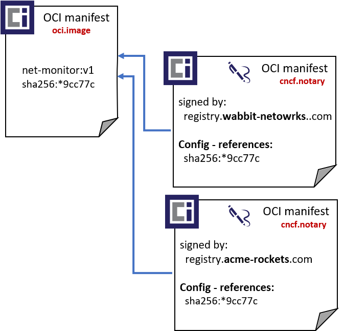
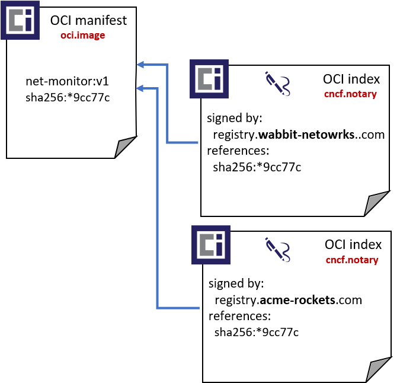

# Adding Config to Index

## TOC

- [Scenarios Config Enables](#scenarios-config-enables)
- [Why Add config to Index](#why-add-config-to-index)
- [Signature Persistance](#signature-persistance)
- [Changes to Index](#changes-to-index)
- [OCI Index Changes](#oci-index)
- [Implications of Revising Index](#implications-of-revising-index)
  
## Scenarios Config Enables

[OCI Artifacts][oci-artifacts] uses the `manifest.config.mediaType` to identify the type of artifact it represents:

|Icon|Artifact|`config.mediaType`|
|-|-|-|
||[OCI Image][image-spec]|`application/vnd.oci.image.config.v1+json`|
||[Helm Chart](https://helm.sh)|`application/vnd.cncf.helm.chart.config.v1+json`|
||[Singularity][singularity], by [Sylabs][sylabs]|`application/vnd.sylabs.sif.config.v1+json`|
|| OPA| `application/vnd.cncf.opa.config.v1`|
||WASM| `application/vnd.wasm.config.v1+json`|

This proposal seeks to add config to Index as well.

## Why Add config to Index

There are other artifact types that either represent a collection of things, or need pointers to other artifacts.

|Icon|Artifact|`config.mediaType`|
|-|-|-|
||[CNAB][cnab]|`application/vnd.cncf.cnab.config.v1+json`|
||[Notary v2][notary-v2]|`application/vnd.cncf.notary.config.v2+jwt`|

### CNAB Scenario

[CNAB][cnab] is a collection of artifacts, where the collection is of type CNAB. The Index would reference an invocation image, some runtime images and a helm chart.

The config of the index would provide identification stating this specific index is of type CNAB and should be treated differently.

The config object could be used to state which image in the collection is the invocation image, vs. runtime images used as references.

#### CNAB Index Example

For mock-up purposes, the digests are replaced with what they represent.

> The details are also not what's currently implemented, rather what could be if index had a config object.

- The cnab client pulls the index using: `registry.example.com/wordpress-cnab:v1.0`
- The cnab client reads the `config.mediaType` and knows it's a CNAB index
- The cnab client reads the contents of the `config.mediaType` to learn which image in the collection is the invocation image, vs. other runtime images
- The cnab client issues a docker run, using the digest of the invocation image, passing in additional parameter information from the config object

``` json
{
  "schemaVersion": 2.1,
  "mediaType": "application/vnd.oci.image.index.v2+json",
  "config": {
    "mediaType": "application/vnd.cncf.cnab.config.v1+json",
    "digest": "sha256:cnab-config-object",
    "size": 1206
  },
  "manifests": [
    {
      "mediaType": "application/vnd.oci.image.manifest.v1+json",
      "digest": "sha256:invocation-image",
      "size": 7023,
      "platform": {
        "architecture": "ppc64le",
        "os": "linux"
      }
    },
    {
      "mediaType": "application/vnd.oci.image.manifest.v1+json",
      "digest": "sha256:runtime-image",
      "size": 7023,
      "platform": {
        "architecture": "ppc64le",
        "os": "linux"
      }
    },
    {
      "mediaType": "application/vnd.oci.image.manifest.v1+json",
      "digest": "sha256:helm-chart",
      "size": 7023
    }
  ]
}
```

### Notary v2 Scenario

[Notary v2 goals][notary-v2-goals] include:

- Maintain the original artifact digest and collection of associated tags, supporting existing dev through deployment workflows
- Multiple signatures per artifact, enabling the originating vendor signature, public registry certification and user/environment signatures
- Native persistance within an OCI Artifact enabled, distribution-spec based registry

In order to meet these goals, we're considering two options for persisting signatures within a registry:

To support the above requirements, signatures are stored as separate [OCI Artifacts][oci-artifacts]. They are maintained as any other artifact in a registry, supporting standard operations such as listing, deleting, garbage collection and any other content addressable operations within a registry.

Following the [OCI Artifacts][oci-artifacts] design, signatures are identified with: `config.mediaType: "application/vnd.cncf.notary.config.v2+jwt"`.
The config object contains the signature and signed content, encoded as a `jwt`. See [nv2-signature-spec][nv2-signature-spec] for details.

Storing a signature as a separate artifact enables the above goals, most importantly the ability to maintain the existing tag and and digest for a given artifact.

## Signature Persistance

Several options for how to persist a signature were explored. We measure these options against the [goals of Notary v2][notaryv2-goals], specifically:

- Maintain the original artifact digest and collection of associated tags, supporting existing dev through deployment workflows
- Multiple signatures per artifact, enabling the originating vendor signature, public registry certification and user/environment signatures
- Native persistance within an OCI Artifact enabled, distribution*spec based registry
- Artifact and signature copying within and across OCI Artifact enabled, distribution*spec based registries
- Support multi-tenant registries enabling cloud providers and enterprises to support managed services at scale
- Support private registries, where public content may be copied to, and new content originated within
- Air-gapped environments, where the originating registry of content is not accessible

To support the above requirements, signatures are stored as separate [OCI Artifacts][oci-artifacts]. They are maintained as any other artifact in a registry, supporting standard operations such as listing, deleting, garbage collection and any other content addressable operations within a registry.

Following the [OCI Artifacts][oci-artifacts] design, signatures are identified with: `config.mediaType: "application/vnd.cncf.notary.config.v2+jwt"`.
The config object contains the signature and signed content. See [nv2-signature-spec][nv2-signature-spec] for details.

### Persistance as Manifest or Index

Storing a signature as a separate artifact enables the above goals, most importantly the ability to maintain the existing tag and and digest for a given artifact.

[OCI Artifacts][oci-artifacts] currently supports [OCI manifest][oci-manifest], but doesn't yet support [OCI index][oci-index]. To work with what's currently supported, the following design is proposed.

1. An artifact (`net-monitor:v1` container image) is pushed to a registry
1. Signature artifacts are pushed using standard [OCI distribution][oci-distribution] apis. For example, using [ORAS][oras].

- [Option 1: oci-manifest](#signature-persistance---option-1-oci-manifest)
- [Option 2: oci-index](#signature-persistance---option-2-oci-index)

| [OCI manifest](#signature-persistance---option-1-oci-manifest) | [OCI index](#signature-persistance---option-2-oci-index)  |
| - | - |
|| 

### Signature Persistance - Option 1: oci-manifest

The challenge with using oci-manifest is how the registry tracks the linkage between the signature and the original artifact.

Example **manifest** for a **Notary v2 signature

```json
{
  "schemaVersion": 2,
  "mediaType": "application/vnd.oci.image.manifest.v2+json",
  "config": {
    "mediaType": "application/vnd.cncf.notary.config.v2+jwt",
    "digest": "sha256:90659bf80b44ce6be8234e6ff90a1ac34acbeb826903b02cfa0da11c82cbc042",
    "size": 1906
  },
  "layers": []
}
```

**Pros with this approach:**

- OCI Artifacts already supports manifest based artifacts, through the `manifest.config.mediaType`

**Cons with this approach:**

- Manifests have no means to reference other artifacts.
- An alternative is required to link a target artifact with it's signature. Either through parsing the signature `manifest.config` object, or a separate API for linking objects.

### Signature Persistance - Option 2: oci-index

This option is similar to using oci-manifest. However, instead of parsing the signature object to determine the linkage between an artifact and signature, the `index.manifests` collection is utilized.

Example **index** for a **Notary v2 signature

``` json
{
  "schemaVersion": 3,
  "mediaType": "application/vnd.oci.image.index.v2+json",
  "config": {
    "mediaType": "application/vnd.cncf.notary.config.v2+jwt",
    "digest": "sha256:90659bf80b44ce6be8234e6ff90a1ac34acbeb826903b02cfa0da11c82cbc042",
    "size": 1906
  },
  "manifests": [
    {
      "mediaType": "application/vnd.oci.image.manifest.v1+json",
      "digest": "sha256:2235d2d22ae5ef400769fa51c84717264cd1520ac8d93dc071374c1be49cc77c",
      "size": 7023,
      "platform": {
        "architecture": "ppc64le",
        "os": "linux"
      }
    }
  ]
}
```

**Pros with this approach:**

- Utilize the existing `index.manifests` collection for linking artifacts.
- Registries that support oci index already have infrastructure for tracking `index.manifests`, including delete operations and garbage collection.
- Existing distribution-spec upload APIs are utilized.
- Unlike the manifest proposal, no additional artifact handler would be required to parse the config object for linking artifacts.
- Based on the artifact type:  `manifest.config.mediaType: "application/vnd.cncf.notary.config.v2+jwt"`, role check may be done to confirm the identity has a signer role.
- As registry operators may offer role checking for different artifact types, signatures are just one of many types they may want to authorize.

**Cons with this approach:**

- OCI index does not yet support the [OCI config descriptor][oci-descriptor]. This would require a schema change to oci-index, with a version bump.
  - This has been a [desired item for OCI Artifacts][oci-artifacts-index] to support other artifact types which would base on Index.
- An additional role check is performed, based on the artifact type. Also noted as a pro as registry operators may want to utilize this for other artifact types, making it a consistent model.

> **Note:** this is the preferred method: See OCI image-spec issue: [Add Index Support for Artifact Type #806](https://github.com/opencontainers/image-spec/issues/)

## Changes to Index

An update of the OCI Index to support `index.config`, enabling an Index to be uniquely identified as a `vnd.cncf.notary.v2` mediaType.

## OCI Index

Current OCI Index: schema version 2

```json
{
  "schemaVersion": 2,
  "mediaType": "application/vnd.oci.image.index.v2+json",
  "manifests": [
    {
      "mediaType": "application/vnd.oci.image.manifest.v1+json",
      "size": 7143,
      "digest": "sha256:e692418e4cbaf90ca69d05a66403747baa33ee08806650b51fab815ad7fc331f",
      "platform": {
        "architecture": "ppc64le",
        "os": "linux"
      }
    },
    {
      "mediaType": "application/vnd.oci.image.manifest.v1+json",
      "size": 7682,
      "digest": "sha256:5b0bcabd1ed22e9fb1310cf6c2dec7cdef19f0ad69efa1f392e94a4333501270",
      "platform": {
        "architecture": "amd64",
        "os": "linux"
      }
    }
  ],
  "annotations": {
    "com.example.key1": "value1",
    "com.example.key2": "value2"
  }
}
```

### Additions

To support OCI Artifact with Index, the following are proposed:

- `config` - provides a means to uniquely identify the type of content the Index contains. The config value is optional.
  - `config.mediaType` - Used consistently with the [OCI Artifact usage of `manifest.config.mediaType`][oci-artifact-unique-artifact]
- `manifests[].config.mediaType` - provides a means to identify the type of artifact in the collection.

```json
{
  "schemaVersion": 3,
  "mediaType": "application/vnd.oci.image.index.v3+json",
  "config": {
    "mediaType": "application/vnd.oci.index.config.v1+json",
    "size": 7023,
    "digest": "sha256:b5b2b2c507a0944348e0303114d8d93aaaa081732b86451d9bce1f432a537bc7"
  },
  "manifests": [
    {
      "mediaType": "application/vnd.oci.image.manifest.v1+json",
      "digest": "sha256:e692418e4cbaf90ca69d05a66403747baa33ee08806650b51fab815ad7fc331f",
      "size": 7143,
      "config.mediaType": "application/vnd.oci.image.v1+json",
      "platform": {
        "architecture": "ppc64le",
        "os": "linux"
      }
    },
    {
      "mediaType": "application/vnd.oci.image.manifest.v1+json",
      "digest": "sha256:5b0bcabd1ed22e9fb1310cf6c2dec7cdef19f0ad69efa1f392e94a4333501270",
      "size": 362,
      "config.mediaType": "application/vnd.oci.prototype.sbom.v1"
    },
    {
      "mediaType": "application/vnd.oci.image.manifest.v1+json",
      "digest": "sha256:5b0bcabd1ed22e9fb1310cf6c2dec7cdef19f0ad69efa1f392e94a433aa23a3a",
      "size": 420,
      "config.mediaType": "application/vnd.oci.prototype.src.v1"
    }
  ]
}
```

## Implications of Revising Index

Updating the Index schema will have impact, and we'll want to call out the things to consider.

### Distribution Spec

The distribution spec will need to account for handling different schemas.
Proposal:

- Check schema version
- If <3 assume all Index objects are multi-arch manifests.
- If =>3, check `config.mediaType`
  - If empty, default to `application/vnd.oci.index.config.v2`
  - Not empty, categorize as OCI Artifacts are tracked within a registry

### Update the docker/distribution Reference Implementation

Update [docker/distribution][docker-distribution] with Index support.
This would likely be done through the [notaryproject/distribution](https://github.com/notaryproject/distribution) fork. As the Notary v2 project evolves, we'll have the PRs needed.

### Container Runtime Clients

These include containerd, docker, umoci, oras, ...
Each client should verify they handle new indexes schemas logic:

- Check schema version
- If <3 assume all Index objects are multi-arch manifests.
- If =>3, check `config.mediaType`
  - If empty, default to `application/vnd.oci.index.config.v2`
  - If `config.mediaType: "application/vnd.cncf.notary.config.v2+jwt"`: process as a signature
  - else: ignore as the runtime clients are not intended to process. Or, they can start to process types they determine are relevant to their scenarios.

[oci-artifact-unique-artifact]:     https://github.com/opencontainers/artifacts/blob/master/artifact-authors.md#defining-a-unique-artifact-type
[cnab]:                https://cnab.io
[docker-distribution]: https://github.com/docker/distribution
[image-spec]:          https://github.com/opencontainers/image-spec/
[notary-v2]:           https://github.com/notaryproject/requirements
[notary-v2-goals]:     https://github.com/notaryproject/requirements/blob/52c1ba2f5696a98b317aff84288d3564b4041ad5/README.md#goals
[nv2-signature-spec]:  https://github.com/notaryproject/nv2/blob/efe151ddf6a7fd3848fea340cab7553d0a7d295b/docs/signature/README.md
[oci-artifacts]:       https://github.com/opencontainers/artifacts
[oci-descriptor]:      https://github.com/opencontainers/image-spec/blob/master/descriptor.md
[oci-index]:           https://github.com/opencontainers/image-spec/blob/master/image-index.md
[oci-manifest]:        https://github.com/opencontainers/image-spec/blob/master/manifest.md
[singularity]:         https://github.com/sylabs/singularity
[sylabs]:              https://sylabs.io/
